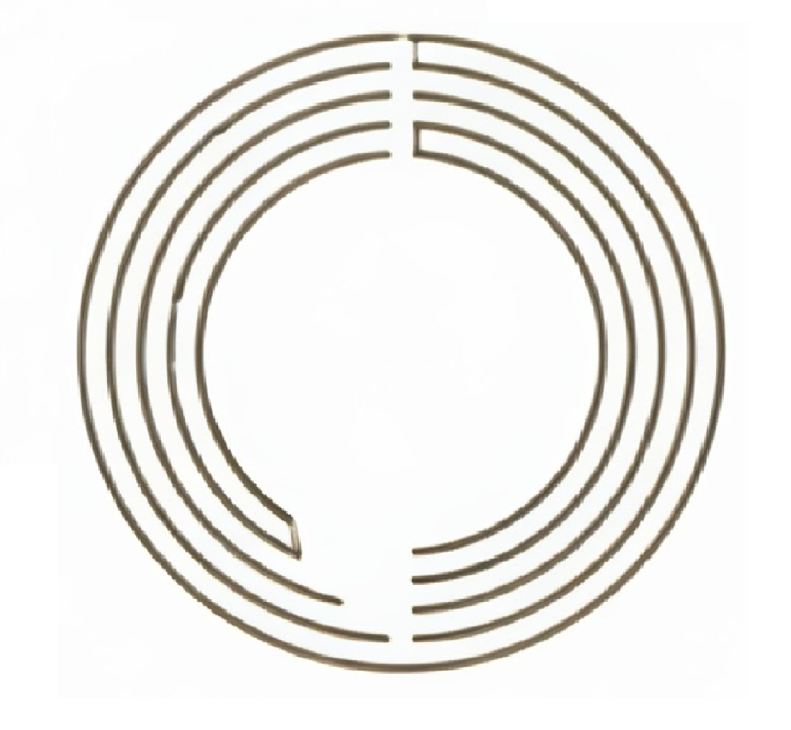

<div id="top"></div>
<!--
*** Thanks for checking out the Best-README-Template. If you have a suggestion
*** that would make this better, please fork the repo and create a pull request
*** or simply open an issue with the tag "enhancement".
*** Don't forget to give the project a star!
*** Thanks again! Now go create something AMAZING! :D
-->


<!-- PROJECT SHIELDS -->
<!--
*** I'm using markdown "reference style" links for readability.
*** Reference links are enclosed in brackets [ ] instead of parentheses ( ).
*** See the bottom of this document for the declaration of the reference variables
*** for contributors-url, forks-url, etc. This is an optional, concise syntax you may use.
*** https://www.markdownguide.org/basic-syntax/#reference-style-links
-->
<!-- [![Contributors][contributors-shield]][contributors-url]
[![Forks][forks-shield]][forks-url]
[![Stargazers][stars-shield]][stars-url]
[![Issues][issues-shield]][issues-url]
[![MIT License][license-shield]][license-url]
[![LinkedIn][linkedin-shield]][linkedin-url] -->


<!-- PROJECT LOGO -->
<br />
<div align="center">
  <a href="https://github.com/manishkumar-hub/The-craft-House">
    
  </a>

<h3 align="center">The Craft kingdom</h3>

  <p align="center">
    <br />
    <a href="https://github.com/manishkumar-hub/The-craft-House"><strong>Explore the docs »</strong></a>
    <br />
    <br />
    <a href="https://the-craft-house.vercel.app/">Go To website</a>
    ·
    <a href="https://github.com/manishkumar-hub/The-craft-House/issues">Report Bug</a>
    ·
    <a href="https://github.com/manishkumar-hub/The-craft-House/issues">Request Feature</a>
  </p>
</div>


<!-- TABLE OF CONTENTS -->
<details>
  <summary>Table of Contents</summary>
  <ol>
    <li>
      <a href="#about-the-project">About The Project</a>
      <ul>
        <li><a href="#built-with">Built With</a></li>
      </ul>
    </li>
    <li><a href="#usage">Usage</a></li>
    <li>
      <a href="#getting-started">Getting Started</a>
      <ul>
        <li><a href="#prerequisites">Prerequisites</a></li>
        <li><a href="#installation">Installation</a></li>
      </ul>
    </li>
    <li><a href="#contributing">Contributing</a></li>
    <li><a href="#license">License</a></li>
    <li><a href="#contact">Contact</a></li>
    <li><a href="#acknowledgments">Acknowledgments</a></li>
  </ol>
</details>


<!-- ABOUT THE PROJECT -->
## About The Project

[[Live Website Link]](https://projectx-lilac.vercel.app)

<b>The Craft kingdom </b> is a ecommerce web application having variety of local and handmade art and craft products . It is fully responsive and has user friendly design .For security purpose , Login and signup is added to authenticate users. All the products shown on are being  fetched from the MongoDB database . It also has integrated <b>Paytm Payment Gateway</b> using paytm APIs and test MID and test MKEY . 


<p align="right">(<a href="#top">back to top</a>)</p>


### Built With

* [Next.js](https://nextjs.org/)
* [Node](https://nodejs.org/en/docs/)
* [Tailwind CSS](https://tailwindcss.com/)
* [Paytm API](https://business.paytm.com/docs/js-checkout/)
* [MongoDB](https://www.mongodb.com/)

<p align="right">(<a href="#top">back to top</a>)</p>


<!-- USAGE EXAMPLES -->
## Usage
To have a look of website Visit : <a href='https://projectx-lilac.vercel.app/login'>The Craft kingdom </a>

DEMO Screenshots 


<br>


<!-- GETTING STARTED -->
## Getting Started

This is a [Next.js](https://nextjs.org/) project bootstrapped with [`create-next-app`](https://github.com/vercel/next.js/tree/canary/packages/create-next-app).


### Prerequisites

This is an example of how to list things you need to use the software and how to install them.
* npm
  ```sh
  npm install npm@latest -g
  ```

### Installation
To get a local copy up and running follow these simple example steps.

1. Clone the repo
   ```sh
   git clone https://github.com/sechafer/projectx.git
   ```
2. Install NPM packages
   ```sh
   npm install
   ```
3. Set up your  `.env` file. Add the following to you `.env `
   ```js
    MONGO_URI 
    NEXT_PUBLIC_HOST 
    NEXT_PUBLIC_PAYTM_HOST
    NEXT_PUBLIC_PAYTM_MID
    NEXT_PUBLIC_PAYTM_MKEY 
    AES_SECRET
    JWT_SECRET 
   ```

<p align="right">(<a href="#top">back to top</a>)</p>


Use this space to show useful examples of how a project can be used. Additional screenshots, code examples and demos work well in this space. You may also link to more resources.

_For more examples, please refer to the [Documentation](https://example.com)_

<p align="right">(<a href="#top">back to top</a>)</p>


<!-- CONTRIBUTING -->
## Contributing

Contributions are what make the open source community such an amazing place to learn, inspire, and create. Any contributions you make are **greatly appreciated**.

If you have a suggestion that would make this better, please fork the repo and create a pull request. You can also simply open an issue with the tag "enhancement".
Don't forget to give the project a star! Thanks again!

1. Fork the Project
2. Create your Feature Branch (`git checkout -b feature/AmazingFeature`)
3. Commit your Changes (`git commit -m 'Add some sechafer'`)
4. Push to the Branch (`git push origin feature/Asechafer`)
5. Open a Pull Request

<p align="right">(<a href="#top">back to top</a>)</p>


<!-- LICENSE -->
## License

Distributed under the MIT License. See `LICENSE.txt` for more information.

<p align="right">(<a href="#top">back to top</a>)</p>


<!-- CONTACT -->
## Contact

Email  -  <a href="mailto:sechafer@gmail.com">Manish </a>

Project Link: [https://github.com/sechafer/projectx](https://github.com/sechafer/projectx)

<p align="right">(<a href="#top">back to top</a>)</p>
